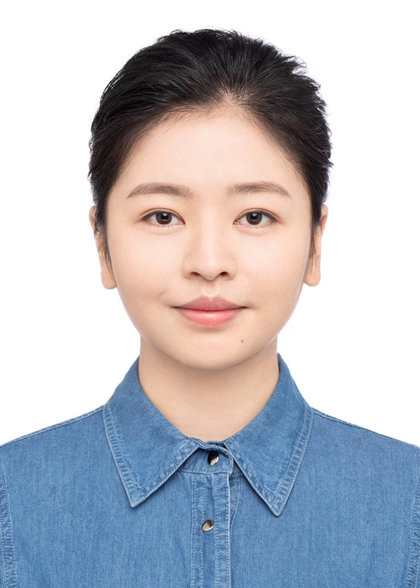
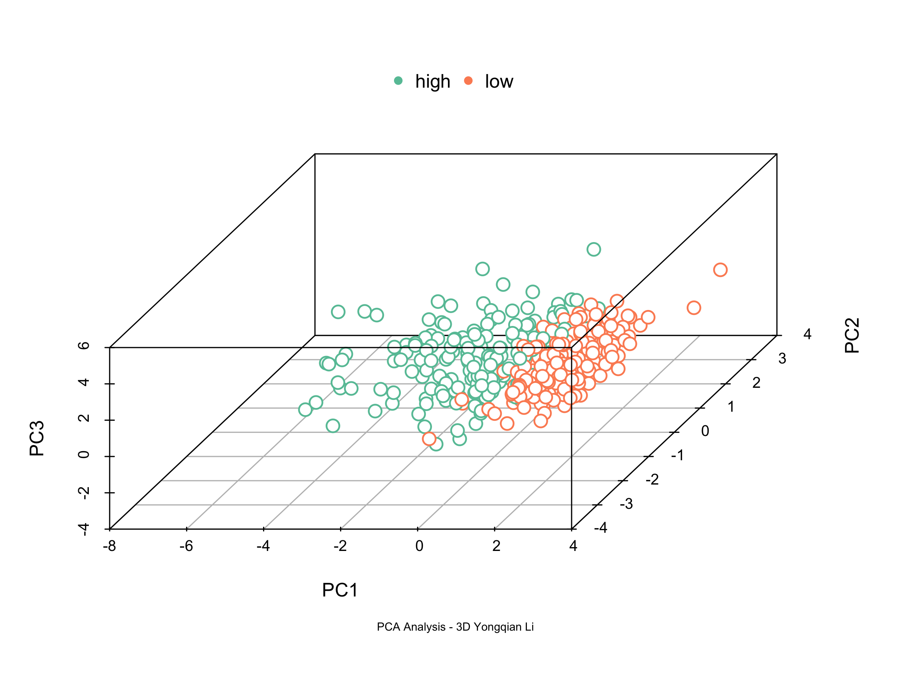

<!DOCTYPE html>
<html lang="en">
<head>
  <meta charset="UTF-8">
  <title>Yongqian Li - CV</title>
  
</head>
<body>

  <h1>Yongqian Li</h1>
  
PhD Candidate | Infertility Research | Experimental Biology & Data Analysis

  

    
  

  

    
<strong>Address:</strong> Rue Martin V 9, 1200 Woluwe-Saint-Lambert

    
<strong>Phone:</strong> +32 0495 354 233

    
<strong>Email:</strong> <a href="mailto:yongqianleee@gmail.com">yongqianleee@gmail.com</a>

  

  

    <h2>Profile</h2>
    

      I am currently a second-year PhD candidate at the Faculty of Medicine, UCLouvain (Belgium), conducting research from January 2023 to March 2025. My focus lies in the fundamental mechanisms of infertility and the development of experimental models. This work has enabled me to build a strong foundation in independent research and acquire substantial technical and analytical skills, especially in the following four domains:
    

    <h3>Core Competencies</h3>
    <ol>
      <li>
        <strong>Experimental Design & Molecular Techniques</strong> 
        I possess hands-on experience with a broad spectrum of molecular and histological methods, including PCR, hematoxylin–eosin (HE) staining, immunohistochemistry (IHC), immunofluorescence (IF), and TUNEL assays. I am capable of independently designing, optimizing, and executing full experimental workflows with high reproducibility. This allows me to generate reliable, interpretable biological data for mechanistic studies.
      </li>
      <li>
        <strong>Data Processing & Scientific Visualization</strong> 
        I am proficient in using R and Python for data analysis, particularly in statistical modeling and bioinformatics. Additionally, I utilize tools such as GraphPad Prism, QuPath, and ImageJ to ensure clean and comprehensive data visualization. This enables efficient transformation of raw biological data into structured, publication-quality insights.
      </li>
      <li>
        <strong>Animal Models & Research Compliance</strong> 
        I am certified in Laboratory Animal Science by the official Belgian online course. My expertise includes murine reproductive procedures (e.g., hCG-induced ovulation, oocyte retrieval, and parthenogenetic activation) and rat model operations (e.g., anesthesia and aseptic surgery). This combination of technical skill and ethical compliance ensures precise, reproducible animal experiments.
      </li>
      <li>
        <strong>Interdisciplinary Training & Independent Project Leadership</strong> 
        Between 2020 and 2021, I received systematic training in bioinformatics and single-cell omics at Qianshuo Bio (Shanghai), which extended my capabilities into data-driven biology. From 2016 to 2019, I worked as a clinical assistant in reproductive medicine (Shanghai University of Traditional Chinese Medicine and Tongji University), where I independently led a rodent-based research project funded by a university innovation grant. I managed all phases of the project—from experimental design to surgical execution and data analysis—demonstrating autonomy, scientific rigor, and leadership.
      </li>
    </ol>
    <h3>Current Objective</h3>
    

      My current research has encountered a significant challenge: key experimental outcomes diverge from clinical datasets derived from over 150 medical centers, and the project lacks sustainable funding. Therefore, I am actively seeking a new PhD opportunity within a team that offers strong scientific infrastructure, interdisciplinary collaboration, and long-term vision. My goal is to further expand my technical expertise and global perspective while contributing meaningfully to high-impact translational medical research.
    

  

  

    <h2>Visualization Gallery</h2>
    
Below are some data charts generated by R language programs:

    

      
      
      
    

  

</body>
</html>
