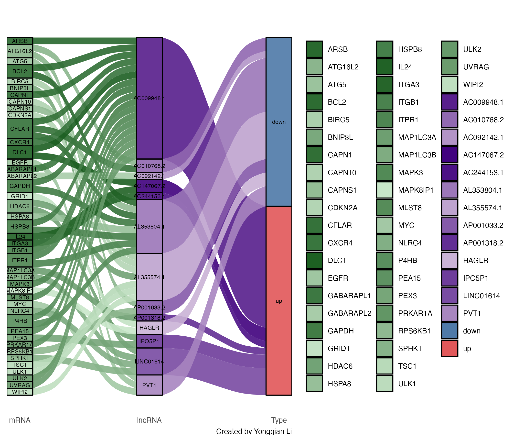

<!DOCTYPE html>
<html lang="en">
<head>
  <meta charset="UTF-8">
  <title>Yongqian Li - CV</title>
  
</head>
<body>

  <h1>Yongqian Li</h1>
  
PhD Candidate | Infertility Research | Experimental Biology & Data Analysis

  

    
  

  

    
<strong>Address:</strong> Rue Martin V 9, 1200 Woluwe-Saint-Lambert

    
<strong>Phone:</strong> +32 0495 354 233

    
<strong>Email:</strong> <a href="mailto:yongqianleee@gmail.com">yongqianleee@gmail.com</a>

  

  

    <h2>Profile</h2>
    

      I pursued a PhD (second-year) in the field of infertility at the UCLouvain University School of Medicine from January 2023 to March 2025...
    

    <!-- 其他内容保持不变 -->
  

  

    <h2>Visualization Gallery</h2>
    
Here are some figures I created using R and Python during my research:

    

      
      
      
    

  

</body>
</html>
